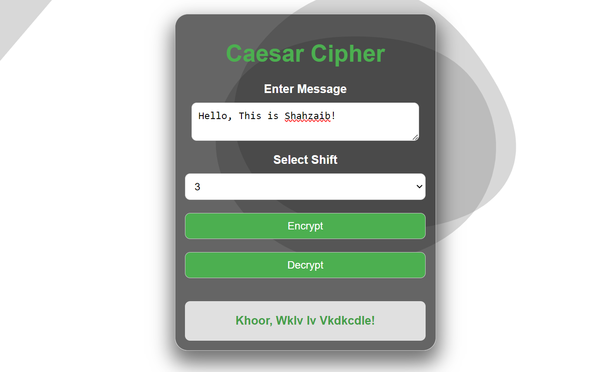

# Caesar Cipher Web Tool

## Overview

Web-based Caesar Cipher tool implemented in HTML, CSS, and JavaScript. This tool provides a user-friendly interface to encrypt and decrypt messages using the Caesar Cipher algorithm.

## Features

- Securely encrypt and decrypt messages.
- User-friendly interface with options for shift selection.

## How to Use

1. Clone this repository to your local machine:

   ```bash
   git clone https://github.com/Shahzaib-D-Memon/caesar-cipher-web.git
   ```

2. Open the index.html file in your preferred web browser.

3. Enter the message, select the shift, and click "Encrypt" or "Decrypt."



## Cybersecurity Highlights

This project emphasizes cybersecurity principles:

### Data Security:

Ensures secure message encryption and decryption in the client's browser.

### User Input Validation:

Implements input validation to enhance data integrity and prevent potential exploits.

### Responsive Design:

Provides a responsive and visually appealing design for a seamless user experience.

### Future Enhancements

Explore additional encryption algorithms.
Implement more advanced cybersecurity features.
Enhance user interface for a better interactive experience.
